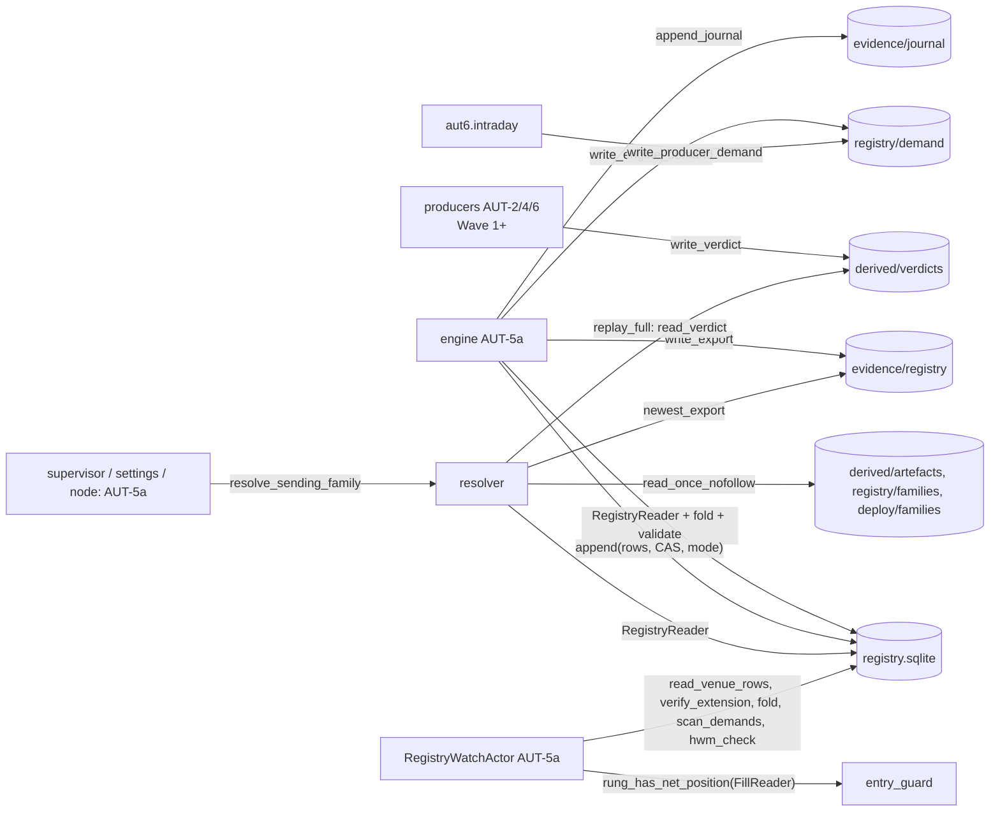

# ARCH-0 seam A: persistence core build plan

Here is the build plan for ARCH-0 seam A. It is plan only: I wrote no files and changed no state. One command was a read-only `.venv/bin/python` import measurement.

Code facts were checked at `d231497d` through codegraph or `sed`. Plan facts come from FROZEN Rev 9.2 and errata E-1…E-13.

## Acceptance Criteria (numbered, testable)

1. **Package exists and is clean.**
   - `src/breezy/persistence/autonomy/` exists, with every module listed in the File-by-File Plan.
   - `cd /home/jon/breezy && .venv/bin/lint-imports` prints "N kept, 0 broken".
   - N includes the two new contracts:
     - (a) `breezy.persistence.autonomy ↛ breezy.adapters`, as ARCH §4.7 requires.
     - (b) The listed ARCH-0 core modules ↛ `nautilus_trader`, with `allow_indirect_imports=false`.
2. **Import weight.** A fresh `import breezy.persistence.autonomy.resolver` loads 0 `nautilus_trader*` modules. Today `import breezy.persistence.live_orders_gate` loads 126 (measured). This needs the lazy `persistence/__init__.py`; every existing `from breezy.persistence import X` (21 sites) returns the identical object.
3. **Explicit serialisation.**
   - Each wire record (C2 label schema, C3 `lineage/v1`, `root/v1`, `refit_run/v1`, C4 `verdict/v1`, C5 transition row, export trailer, `demand/v1`, `drill_marker/v1`, `journal/v1`, HWM value) has an explicit `to_wire() -> dict` and `from_wire(payload) -> Self`.
   - `from_wire` refuses missing keys, unknown keys, wrong types, bools passed as ints, NaN or Inf, and a `schema` value outside that type's `ACCEPTED_SCHEMAS`.
   - An AST test finds no `dataclasses.asdict`/`astuple` anywhere under `persistence/autonomy`.
4. **Canonical bytes.**
   - `canonical_json(x)` is `json.dumps(sort_keys=True, separators=(",",":"), ensure_ascii=False, allow_nan=False)` in UTF-8.
   - Decimals are written only as `decimal_str(d) == format(d.normalize(), "f")` (zero is `"0"`, as AUT-4 K9 requires). Any other type raises `CanonicalTypeError`.
   - A golden-bytes test pins three fixtures.
5. **Single read.**
   - `read_once_nofollow(path, *, root, max_bytes)` refuses any symlink path component below `root` (`lstat` walk plus final `O_NOFOLLOW`). It reads once through one fd and refuses more than `max_bytes`.
   - `read_once_at(dirfd, name, …)` uses `openat` with `O_NOFOLLOW` on an `fstat`-checked `O_DIRECTORY|O_NOFOLLOW` descriptor.
   - Every ARCH-0 reader goes through these two functions (AST test).
6. **Atomic writes.**
   - `write_once(path, data, *, mode)`: `mkstemp` in the target directory, write, `fsync`, `os.link` (EEXIST means refused), unlink the temp, `fsync` the directory.
   - `replace_atomic(...)`: `mkstemp`, write, `fsync`, `os.replace`, `fsync` the directory.
   - These are the only `os.link`/`os.replace` sites in ARCH-0 modules (AST test).
7. **Store.** `RegistryStore` implements the C5 `transitions` DDL with exactly the AUT-5 r7 §3.2 column set:
   - `UNIQUE(venue, venue_seq)` and `UNIQUE(transition_id)`;
   - `BEFORE UPDATE`/`BEFORE DELETE` → `RAISE(ABORT,'append-only')`;
   - `journal_mode=DELETE`, `synchronous=FULL`, `meta.schema='registry/v1'`;
   - dir 0700, file 0600.
8. **Append path.** `RegistryStore.append(rows, *, expected_prior_seq, mode)` runs in one `BEGIN IMMEDIATE`:
   - all ids already present → logged no-op;
   - `KIND_MASK[mode]` check;
   - stage flag: `pins.ENABLED_WIDENING_KINDS`, read at call time;
   - CAS on `max(venue_seq)`;
   - `transitions.validate` against `fold(prior ∪ new)`;
   - insert, chain extend, cache refold, COMMIT.
   Any failure rolls back completely.
9. **Chain.**
   - Genesis is `sha256(b"registry/v1|"+venue)`.
   - `transition_hash = sha256(canonical_row ‖ prev_transition_hash)`, where `canonical_row` excludes `seq`, `prev_transition_hash` and `transition_hash`.
   - `transition_id` hashes the C5 Y9 tuple (`expected_prior_seq` excluded).
   - `verify_venue_chain` detects any edit, reorder, deletion or splice.
10. **Reader.** `RegistryReader` opens `file:…?mode=ro` plus `PRAGMA query_only=ON` (E-7 rule 3), one connection per call, never shared across threads. A write through it raises. A hot journal from a killed writer gives `RegistryUnreadable`.
11. **Kinds real in ARCH-0.** These kinds are fully validated and applied by the store and the fold: BOOTSTRAP (genesis only, `pins.BOOTSTRAP_SEED` ids, a second BOOTSTRAP per venue refused), MINT (structural rules plus ≤ 1 counted MINT per lineage per UTC day), DEMOTE, HALT, SWAP_CANCEL, TARGET_INELIGIBLE, RETIRE and ATTEST.
12. **Kinds the fold applies but the store refuses at this stage.** For PROMOTE→CHAMPION, DRILL_ADMIT, DRILL_PROMOTE, ROLLBACK, RESUME, ROOT_ADMIT, ACTIVATE, SUPERSEDE and DISPLACED:
    - The fold applies their effects (pending, ACTIVATE, lapse, voiding).
    - The store refuses them with `WideningNotEnabled` while `pins.ENABLED_WIDENING_KINDS == frozenset()`.
    - SHADOW→CHALLENGER PROMOTE is refused with `NominationRequiresPolicy` until the policy parser lands (AUT-5 WP3).
    - HWM_RESET is refused with `RuleSetPending` until AUT-5 WP8.
13. **Fold.** `fold(rows, venue, now_ns)` is pure and computes:
    - states;
    - pending, ACTIVATE in [16:40Z, LAUNCH), and lapse at LAUNCH;
    - SWAP_CANCEL voiding, including the [LAUNCH, 17:00Z) post-launch void;
    - `demoted_for_cause`, `rollback_eligible`, `target_ineligible`, `terminal_frozen` (lineage) and the INTEGRITY freeze (venue);
    - `drill_episode` intervals;
    - counter tallies charged on effect;
    - the invariant "≤ 1 family in {CHAMPION, HALTED} per venue".
    No wall clock is used: an AST test bans `time.time`, `datetime.now` and `time.monotonic` in the core modules.
14. **Resolver.** `resolve_sending_family(...)` returns `ResolvedFamily | ResolverRefusal` and refuses every case in the closed ARCH list. It:
    - verifies the chain from genesis, the newest export prefix and the HWM;
    - replays validation over the full fold;
    - binds manifest and artefact bytes to the authorising row, root via `<root>_r<NNNN>`, §4.2 equality against the committed root, `LIVE_GATE_ROUTED_KINDS`, the engine pin, the root triple through `live_orders_authorized`, and the child d0 at the first →CHAMPION row.
    Each refusal has its own test.
15. **Entry guard.** `entry_guard.rung_has_net_position(base_slug, *, reader)` nets YES and NO durable fills with the leg sign through the injected `FillReader` Protocol and returns `bool | GuardUnreadable`. A missing record or an unreadable index gives `GuardUnreadable`; the caller vetoes.
16. **C4 verdict writer.**
    - `verdict_id = sha256(canonical body − {verdict_id, produced_at_ns})`.
    - Path: `derived/verdicts/<family>/<UTC date of valid_until_ns>/<id>.json`, 0600, write-once.
    - The same id with a body equal modulo `produced_at_ns` is a no-op. A different body raises `VerdictIdCollision`.
    - Validity above `MAX_VERDICT_VALIDITY_H` is refused.
17. **Demand.**
    - Writer: exact-set `demand/v1`, ≤ `DEMAND_FILE_MAX_BYTES`, `DEMAND_WRITER_PRODUCER_IDS` gate, one unarchived file per (family, reason), idempotent on `verdict_id`, producer cap `DEMAND_FILES_MAX − DEMAND_INTEGRITY_RESERVED`.
    - Reader: returns a venue-wide veto on any bad file or on more than `DEMAND_FILES_MAX` files.
    - No rename, edit or delete API is exposed to producers. The archive is AUT-5 WP4's.
18. **Rollback journal.**
    - `append_journal(paths, kind, venue, record)` writes a write-once (0444), `prev_sha256`-linked `journal/v1` envelope.
    - `read_journal_chain` verifies the links from a kind-and-venue genesis.
    - Unknown kinds are refused. The per-kind record keys are AUT-7's.
19. **Pins.** `pins.py` holds only literals:
    - every §4.5 ceiling as amended by E-11 (no `SELF_HEAL_*` rows);
    - `ENGINE_SOURCE_SHA256 = frozenset()`, `PRODUCER_SOURCE_SHA256 = {}`, `REVOKED_SOURCE_SHA256 = frozenset()`;
    - `ENABLED_WIDENING_KINDS = frozenset()`, `POLICY_RULING_PIN = ()`, `ROOT_ADMIT_ENABLED_CEILING = False`;
    - `LIVE_GATE_ROUTED_KINDS = {"forecast_quantile_ladder"}`;
    - `BOOTSTRAP_SEED`, `DEMAND_WRITER_PRODUCER_IDS = ("aut6.intraday",)`, `DEMAND_REASONS`, `CAUSE_CODES`, `HALT_REASON_CLASS_MAP`, `DEFAULT_RESTRICTIVE_CLASS`;
    - the schedule constants, test-equal to `trade_supervisor_core.py:37-44`.
    An AST test proves no `src/` module assigns to a `pins` attribute.
20. **C6.**
    - `plugin.py` defines the `CaptureAdapter`, `Scorer`, `Evaluator`, `Detector`/`DriftDetectors` and `Refitter` Protocols plus `RefusingPlugin`.
    - `NODE_PLUGINS` (strategy) and `OFFLINE_PLUGINS` (analysis) each have exactly the four `_COMPOSITION_KINDS` keys (`family_manifest.py:118-120`), all `RefusingPlugin` at ARCH-0.
    - `test_family_plugin_exact_set` is GREEN.
21. **Placeholder ledger.**
    - Every §4.7 test name (E-11-renamed) exists as a collected test function, either real or carried as `xfail(strict=True, raises=OwnerPending, reason="owner AUT-n WPk")`.
    - The ledger equals the markers.
    - A widening kind can be added to `ENABLED_WIDENING_KINDS` only when every ledger row that blocks it is cleared.
22. **Gate.** The full gate `scripts/ci/run_tests_no_egress.sh` exits 0 after every WP merge (L-43). The mypy ratchet and `lint-imports` both pass. RED→GREEN logs are kept for each real test.

## Edge Cases & NFRs (fail-closed, one-writer, symlink refusal, atomicity, thread-affinity)

**Fail-closed: every failure gives the restrictive outcome, never a default.**

| Input / condition | Result |
|---|---|
| Unknown `schema`, unknown or missing key, bool where an int is expected, NaN/Inf, oversize file | `WireRefused(reason)`. Resolver → `ResolverRefusal`; demand reader → venue veto; verdict reader → `VerdictUnreadable`, which the engine treats as ERROR |
| Empty chain with `BREEZY_FAMILY_SOURCE=registry` | `ResolverRefusal(empty_chain)` = no champion (`test_family_source_registry_requires_bootstrap`) |
| Hot journal, locked DB, `sqlite3.DatabaseError`, missing registry dir | `RegistryUnreadable` → resolver refusal. Never "no rows" |
| Newest export absent while the chain has ≥ 1 row older than 26 h | `export_unreadable` refusal. Before the first export (rows < 26 h old) the export check is `not_yet_due`, and is recorded on `ResolvedFamily.export_check` |
| HWM seq higher than the chain head, or same seq with a different head | `hwm_regressed` |
| `engine_code_sha` of the authorising row ∉ `ENGINE_SOURCE_SHA256` or ∈ `REVOKED` | `engine_code_unpinned`. At ARCH-0 the pins are empty, so every resolution refuses. That is intended: no runtime caller exists yet |
| Child with no `_LINEAGE_POLICY_ALLOWLIST` row (empty at ARCH-0) or an empty `POLICY_RULING_PIN` | `root_not_lineage_allowlisted` / `ruling_not_policy` |
| `FillReader` raises, or an index names a missing record | `GuardUnreadable` → the caller vetoes (AUT-5a) |
| Demand dir unreadable, bad file, family not in fold, reason ∉ `DEMAND_REASONS`, > `DEMAND_FILES_MAX` | `DemandScan.venue_veto=True` |
| Journal link broken | `JournalUnverified`. AUT-7 maps it to `journal_unverified`; restrictive writes are never blocked (L-48) |

**One writer (L-50).** Each ARCH-0 path pattern has exactly one row in `tests/unit/autonomy_writer_table.py`, and `test_autonomy_files_have_one_writer` checks it:

| Path | Writer process types |
|---|---|
| `registry/registry.sqlite` | `registry/engine.lock`: engine, HWM-reset CLI |
| `evidence/registry/registry_<venue>_<date>[_hwm<k>].jsonl` | write-once: engine |
| `derived/verdicts/**` | write-once: producers |
| `registry/demand/<venue>/*` | write-once: engine plus `DEMAND_WRITER_PRODUCER_IDS` |
| `evidence/journal/<venue>/<kind>/<seq>.json` | write-once plus a seq-named EEXIST guard: engine |
| `derived/artefacts/<model_class>/<sha>/{artefact.json,roots/<family_id>.json}` | write-once: engine bootstrap mode, AUT-3 refit |

The table is data; Wave 1 owners add their own rows. The test also AST-scans `breezy.persistence.autonomy` and fails on any write site outside `single_read.{write_once,replace_atomic}` and `registry_store` (sqlite).

**Symlink refusal.**
- Every read and write path is built from an `AutonomyPaths(root)` value. No path is joined from a string outside `paths.py`.
- Reads use `read_once_nofollow(…, root=paths.root)`.
- `write_once` refuses a symlinked parent directory (`lstat` walk) before `mkstemp`.
- Store open refuses a symlinked `registry.sqlite` or `registry/` (`lstat` before `connect`).

**Atomicity.**
- A multi-row append (pair + ACTIVATE; MINT + ADMIT; SWAP_CANCEL + TARGET_INELIGIBLE) is one SQLite transaction: all rows or none.
- A crash inside `write_once` leaves at most an unlinked `mkstemp` temp. Temps use the `.tmp.` prefix and are swept by the owner engine; the store never sweeps.
- A crash in `replace_atomic` leaves the old bytes.

**Thread affinity.**
- No ARCH-0 object holds a connection across calls. `RegistryReader.read_venue_rows(venue, after_seq=…)` opens, reads and closes on the calling thread.
- The library starts no thread or timer and uses no `asyncio` (AST test).
- The watch actor's loop-thread bridge is AUT-5a's. ARCH-0 guarantees its functions can be called on any one thread without shared state: no module-level mutable state (AST: no module-level `dict`/`list` assignment except `Final` frozensets, tuples and `MappingProxyType`).

**Clock.** Every function that depends on time takes `now_ns: int` explicitly.

**Hygiene.**
- Exception `str()` and refusal objects carry enum reasons and role names (`"registry_db"`, `"export"`), never absolute paths (`test_autonomy_payload_hygiene_scan` covers the refusal classes and every `to_wire`).
- Wire records have no field named `path`. The C3 `root/v1` field `committed_path` is repo-relative (`deploy/families/<id>.json`) and is checked to be relative.

**Size and performance.**
- `fold` and `replay` are O(rows). `test_resolver_under_budget`: 10,000 synthetic rows resolve in ≤ 2 s wall time.
- `closure_sha256` runs in ≤ 5 s and ≤ 128 MB, with no `grimp` in `sys.modules` (AUT-5 r7 WP1 budget).

**Root permission.** The no-egress gate may run under `unshare -r` (uid 0 in the namespace; `scripts/ci/run_tests_no_egress.sh`), where permission bits are bypassed. So mode assertions use `stat().st_mode`, never a denied open. The `0500` read-only-dir test asserts that SQLite `mode=ro` semantics give `SQLITE_READONLY` behaviour, which does not depend on uid.

## Architecture & Data Flow (modules, public API signatures, storage layout + paths, layering vs import-linter layers app > analysis > strategy > runtime > adapters > ingest > persistence|registry|normalize > settlement > domain)

**Layering.**
- Everything is in `persistence` (`pyproject.toml:78-100`), except `NODE_PLUGINS` (strategy) and `OFFLINE_PLUGINS` (analysis), which ARCH C6 places there.
- `persistence` may import only `persistence|registry|normalize`, `settlement`, `domain` and stdlib.
- The existing layers contract already makes `persistence.autonomy → adapters/runtime/strategy/analysis` illegal. Contract (a) is the ARCH-named, deliberately redundant pin (the same idiom as `pyproject.toml:176-209`).
- Contract (b) keeps the core modules free of Nautilus and pyarrow (pyarrow by placing it only in `label_schema.py`). It is scoped to an explicit module list, because AUT-1 r12 (E-12) places `@customdataclass` capture modules in the same package (`AUT-1…r12.md:229-238`).

**Modules and public API** (all `from __future__ import annotations`, mypy strict):

```text
persistence/autonomy/
  __init__.py        docstring only; imports nothing (import-light, AUT-4 AH5)
  canonical.py       canonical_json(obj: WireValue) -> bytes; sha256_hex(b: bytes) -> str;
                     decimal_str(d: Decimal) -> str; CanonicalTypeError
  wire.py            require_exact_keys(p, required, optional=frozenset()) -> None; require_str/int/bool/
                     sha256/enum/decimal_str/ns(...); WireRefused(reason: str)
  single_read.py     read_once_nofollow(path: Path, *, root: Path, max_bytes: int) -> bytes;
                     read_once_at(dirfd: int, name: str, *, max_bytes: int) -> bytes;
                     open_dir_nofollow(path: Path, *, root: Path) -> int;
                     write_once(path: Path, data: bytes, *, mode: int, root: Path) -> WriteOnceResult(CREATED|EXISTS_EQUAL|EXISTS_DIFFERENT);
                     replace_atomic(path: Path, data: bytes, *, mode: int, root: Path) -> None;
                     ensure_dir(path: Path, *, root: Path, mode: int = 0o700) -> None; SingleReadRefused(reason)
  paths.py           AutonomyPaths(root: Path) with: registry_dir, registry_db, engine_lock, registry_families_dir,
                     demand_dir(venue), heartbeat(venue), drill_dir, drill_marker, exports_dir, export(venue, date, hwm_seq|None),
                     verdict_dir(family, date), verdict(family, date, vid), artefact_dir(model_class, sha), artefact(model_class, sha),
                     root_record(model_class, sha, family_id), journal_dir(venue, kind), shadow(root) ; default_data_root() -> Path
  pins.py            literals only (AC 19)
  veto.py            VetoReason(StrEnum) — the ARCH C5 closed list (registry_*, dead-engine, transient, capture_untagged,
                     alerts_undeliverable, rung_net_position_held); EntryVeto = Callable[[str], VetoReason | None]
  plugin.py          Protocols CaptureAdapter, Scorer, Evaluator, Detector(id, kind: DetectorKind, evaluate), DriftDetectors,
                     Refitter; NotFittable; NodePlugins(capture, detectors); OfflinePlugins(scorer, evaluator, refitter, detectors);
                     RefusingPlugin (every member raises PluginRefused; .refusing = True); is_complete(p) -> bool
  closure_manifest.py CLOSURE_MODULES: Final[Mapping[str, tuple[str, ...]]] = {}  (regenerated by script)
  closure.py         closure_sha256(component: str) -> str ; closure_from_grimp(entry: str) -> tuple[str, ...]  (gate-only, lazy grimp import)
  hwm.py             REGISTRY_HWM_KEY_PREFIX = "autonomy/registry_hwm/"; Hwm(venue, venue_seq, chain_head); hwm_key(venue);
                     Hwm.to_bytes()/from_bytes(); hwm_check(hwm, chain: VerifiedVenueChain) -> HwmOk | HwmRegressed
  schemas.py         C5 enums State, Kind, CauseClass, CauseCode, WriterMode, DecidedBy; TransitionRow (every C5 column;
                     to_wire/from_wire); ResolvedFamily; ResolverRefusal(reason: RefusalReason); ExportTrailer
  verdict.py         C4: VerdictKind, Outcome, ActionClass, Assumption (closed 5), InputRef; Verdict (every C4 field);
                     verdict_id(v) -> str; write_verdict(paths, v) -> WriteOnceResult; read_verdict(paths, family, date, vid) -> Verdict
  lineage.py         C3: DataWindow, LeakageAssertion, Lineage(lineage/v1), RootRecord(root/v1), RefitRun(refit_run/v1),
                     RefitOutcome; model_class_of(kind, component) -> str
  label_schema.py    C2: LABEL_SCHEMA_ID="label/v1"; LABEL_V1_ARROW_SCHEMA (pa.Schema, column for column); ExcludedReason;
                     PSource; LabelRole  (only module importing pyarrow; outside contract (b) list)
  demand.py          DemandRecord(demand/v1: schema, venue, family_id, reason, writer, ts_ns, verdict_id|null);
                     write_engine_demand(paths, rec) ; write_producer_demand(paths, rec, *, producer_id) -> DemandWrite(WRITTEN|EXISTS|CAPPED);
                     scan_demands(paths, venue, *, fold_family_ids) -> DemandScan(per_family, venue_veto, reasons)
  drill_marker.py    DrillMarker(drill_marker/v1, the AUT-7 r5 12-key exact set); read_marker_at(dirfd) -> DrillMarker|MarkerAbsent|MarkerError
  rollback_journal.py JOURNAL_KINDS: Final[frozenset[str]] = frozenset(); JournalEntry; JournalHead(seq, sha256);
                     append_journal(paths, kind, venue, record, *, ts_ns) -> JournalHead; read_journal_chain(paths, kind, venue) -> tuple[JournalEntry,...] | JournalUnverified
  transitions.py     ALLOWED: Final[frozenset[tuple[State|None, State, Kind]]] (C5 table verbatim); KIND_MASK; WIDENING_KINDS;
                     RESTRICTIVE_KINDS; PAIR_KINDS; transition_id(row) -> str; validate(fold, rows, *, mode: WriterMode|None, now_ns) -> RefusalReason|None
  chain.py           genesis(venue) -> str; transition_hash(row, prev) -> str; VerifiedVenueChain(venue, rows, head, venue_seq);
                     verify_venue_chain(rows, venue) -> VerifiedVenueChain | ChainBroken; verify_extension(prev: VerifiedVenueChain, new_rows) -> ...;
                     seq_is_verified_prefix(chain, seq) -> bool; verify_against_export(chain, trailer) -> ok | ExportPrefixMismatch
  registry_store.py  RegistryStore.initialise(paths) ; RegistryStore(paths).append(rows, *, expected_prior_seq, mode) -> AppendResult;
                     RegistryStore.write_export(venue, *, date, now_ns, journal_heads) -> ExportTrailer;
                     RegistryReader(paths, *, busy_timeout_ms).read_venue_rows(venue, after_seq=0) -> tuple[TransitionRow,...];
                     newest_export(paths, venue) -> (ExportTrailer, rows) | ExportUnreadable | ExportAbsent
  fold.py            fold(rows, venue, now_ns) -> FoldResult; resolve_champion(chain, now_ns) -> FoldResult (ARCH name, AUT-7);
                     FoldResult(families, pending_pairs, lineages, venue_view, sender_family_id); FamilyView; LineageView; LineageTallies
  replay.py          replay_full(chain, *, paths) -> ReplayOk | ReplayInvalid(row_seq, reason) | ReplayCauseUnresolved
  net_position.py    LegFill(leg: Leg, side: Literal["BUY","SELL"], qty: Decimal); net_signed_qty(fills) -> Decimal   (AUT-2 adds average_cost_basis)
  entry_guard.py     FillReader(Protocol): fill_index(instrument_id) -> tuple[str,...]; fill_record(venue_order_id) -> FillRow;
                     FillRow(order_side, cumulative_qty); GuardUnreadable; rung_has_net_position(base_slug, *, reader, venue_suffix) -> bool|GuardUnreadable
  resolver.py        FamilySource(UNSET|REGISTRY_SHADOW|REGISTRY); read_family_source(env: Mapping[str,str]) -> FamilySource;
                     resolve_sending_family(*, venue, paths, repo_root, now_ns, hwm: Hwm|None) -> ResolvedFamily|ResolverRefusal;
                     verify_family_bytes(row, *, paths, repo_root) -> FamilyBytes|ByteBindingFailure  (AUT-7);
                     manifest_equal_modulo_allowlist(child: FamilyManifest, root: FamilyManifest) -> tuple[str,...]  (offending keys)
strategy/autonomy/node_plugins.py     NODE_PLUGINS: Final[Mapping[str, NodePlugins]]
analysis/autonomy/offline_plugins.py  OFFLINE_PLUGINS: Final[Mapping[str, OfflinePlugins]]
```

**Storage layout.** All paths are under `/home/jon/.local/share/breezy/` (ARCH §3). Dirs are 0700, files 0600, content-addressed files 0444.

- `registry/registry.sqlite`, plus `registry/engine.lock` (the lock is created by the engine unit, AUT-5a).
- `registry/families/<id>.json` (0444), `registry/demand/<venue>/`, `registry/heartbeat/<venue>.json`, `registry/drill/marker.json`. Writers for these are AUT-5a/AUT-7. ARCH-0 ships the paths, types and readers.
- `evidence/registry/registry_<venue>_<YYYY-MM-DD>.jsonl` (0444):
  - each line is one `TransitionRow.to_wire()`;
  - the last line is an `ExportTrailer`: `{"schema":"registry_export/v1","venue","venue_seq","chain_head","export_seq","evidence_journal_heads":{kind: sha|null}}`;
  - the HWM variant is `…_hwm<export_seq>.jsonl`;
  - `evidence_journal_heads` is included now, so AUT-7's T7 needs no L-12 widening later.
- `evidence/journal/<venue>/<kind>/<seq:010d>.json` (0444, `journal/v1`).
- `derived/verdicts/<family_id>/<YYYY-MM-DD of valid_until_ns>/<verdict_id>.json`.
- `derived/artefacts/<composition_kind>:<component>/<sha>/artefact.json` (0444) and `…/<sha>/roots/<family_id>.json` (0444). The second path depends on the proposed **E-14** (Risk R1).
- `registry-shadow/`: same layout. `AutonomyPaths.shadow(root)` is a distinct root.

**Data flow.**



## Stub Surface for Wave 1 (table: symbol | consumer plan + section | ARCH-0 delivers real or stub)

"Real" means the behaviour is implemented and tested. "Stub" means the signature and type exist and the body fails closed with `OwnerPending` or a refusal, with the owner named.

| Symbol | Consumer (plan § / line) | ARCH-0 |
|---|---|---|
| `VetoReason` (incl. `capture_gap`, `feed_stale`, `recorder_stale`, `capture_untagged`), `EntryVeto` | AUT-1 r12 §5.1 (`:1237`); AUT-5 r7 §3.1 (`:122` re-points to import, not define) | Real |
| `NODE_PLUGINS`, `RefusingPlugin`, `CaptureAdapter`/`Detector` Protocols | AUT-1 r12 `:15,:1237`; AUT-6 WP5 (`:1320`) | Real; every kind `RefusingPlugin` (owners fill members) |
| `OFFLINE_PLUGINS`, `Scorer`, `Evaluator`, `Refitter`, `NotFittable` | AUT-2 r7 `:943`; AUT-3 r6 `:15`; AUT-4 r11 `:1362` | Real; `RefusingPlugin` |
| `pins.WATCH_TICK_STALE_S` | AUT-1 r12 `:1237` | Real (180) |
| `pins.SELF_HEAL_RESTARTABLE_UNITS` | AUT-1 r12 `:1237` (stale; AUT-1 `:749` and E-11 delete it) | **Not shipped** (E-11; `WATCHDOG_DAEMON_UNITS` is AUT-6's `detector_catalog.py`, `AUT-6 r15:179`) |
| `pins.MAX_VERDICT_VALIDITY_H`, `ATTEST_VERDICT_VALIDITY_H`, `INTRADAY_ATTEST_VERDICT_PERIOD_MIN`, `POST_STOP_RECONCILE_RUNTIME_S`, `POSTSTOP_POSITIONS_MAX_PAGES` | AUT-2 r7 `:15` | Real |
| `pins.MAX_MINTS_PER_LINEAGE_PER_DAY`, `MIN_GATE_DECISIONS_CHANGED` | AUT-3 r6 `:71` | Real |
| `pins.MAX_NOMINATIONS_*`, `BOOTSTRAP_B_MAX` (= 524 288, AUT-4 r11 `:493`), `MIN_CALIBRATION_BUCKETS` (= 1 floor; AUT-4 raises), `DEFAULT_RESTRICTIVE_CLASS` | AUT-4 r11 `:1365` | Real |
| `pins.PRODUCER_SOURCE_SHA256`, `ENGINE_SOURCE_SHA256`, `REVOKED_SOURCE_SHA256`, `closure_sha256` | AUT-6 r15 `:514,:1477`; AUT-4; AUT-5 WP4 | Real machinery, empty sets (owners add pins with their entry points) |
| `pins.DEMAND_WRITER_PRODUCER_IDS`, `DEMAND_REASONS` (incl. `integrity_floor`) | AUT-6 WP5b `:1331` | Real |
| `demand.write_producer_demand`, `scan_demands` | AUT-6 WP5b; AUT-5 WP5 | Real |
| `demand.archive` | AUT-5 WP4 (§3.3.5) | **Not in ARCH-0** (engine-only; needs a bwrap integration test) |
| `verdict.Verdict`, `verdict_id`, `write_verdict`, `read_verdict`, `decimal_str` | AUT-2 `:943`; AUT-4 `:450,:458`; AUT-6 `:512` | Real |
| `label_schema.LABEL_V1_ARROW_SCHEMA`, `ExcludedReason`, `PSource` | AUT-2 r7 `:15,:63` | Real (`label_store.py` is AUT-2's) |
| `net_position.net_signed_qty`, `LegFill` | AUT-2 r7 `:68,:116`; `entry_guard` | Real (AUT-2 WP2 adds `average_cost_basis`, file then **modified**, not new) |
| `lineage.Lineage`, `RootRecord`, `RefitRun`, `model_class_of` | AUT-3 r6 `:15,:71`; AUT-5 bootstrap; AUT-7 | Real (types and structural validation; the C3 writer's assertions are AUT-3's) |
| `RegistryStore.append(rows, *, expected_prior_seq, mode)`, `KIND_MASK`, `WriterMode` | AUT-7 r5 `:703`; AUT-5 WP4 | Real for the kinds in AC 11; the AC 12 kinds are refused (stage flag / pending rule set) |
| `RegistryReader`, `VerifiedVenueChain`, `verify_venue_chain`, `verify_extension`, `resolve_champion`, `fold` | AUT-7 `:703`; AUT-3 `:15` ("read-only resolver fold"); AUT-4 `:15`; AUT-5 WP5 | Real |
| `FoldResult.lineages[*].tallies` (`nominations`, `k_life` index, `mints`, drill tallies, `infra_resumes`, `drill_close_restores`) | AUT-4 (nomination columns), AUT-7 (V15, E-5) | Tallies real; **budget/ceiling admission** stub (`OwnerPending`, owner AUT-5 WP1b) |
| `TransitionRow` nomination columns (`k_life`, `alpha_k`, `n_min_eff`, `n_cap`, `nomination_feasible`) | AUT-4 r11 `:1435` | DDL plus "required on SHADOW→CHALLENGER PROMOTE, null elsewhere" real; nomination admission refused (`NominationRequiresPolicy`) |
| `resolve_sending_family`, `ResolvedFamily`, `ResolverRefusal`, `read_family_source` | AUT-5 WP5/WP6 (node, supervisor, settings); AUT-1 r12 `:15` (`ResolvedFamily`); AUT-6 WP6 (`:1497` "AUT-5a's resolver stub") | Real |
| `verify_family_bytes(row)` | AUT-7 r5 `:703` (E10) | Real |
| `parse_family_manifest(raw, *, path, allow_draft)` | resolver; AUT-5 WP2 four-site widening | Real (byte-identical split of `load_family_manifest`) |
| `live_orders_gate._LINEAGE_POLICY_ALLOWLIST` | resolver; AUT-5 WP9 adds the row | Real, **empty** literal (grants nothing) |
| `entry_guard.FillReader`, `rung_has_net_position`, `GuardUnreadable` | AUT-5 WP2/WP5; adapter `fill_reader.py` (AUT-5a) | Real (the adapter reader is AUT-5a) |
| `hwm.Hwm`, `hwm_key`, `hwm_check` | AUT-5 WP5 (watch actor), WP8 (reset CLI) | Real |
| `rollback_journal.append_journal`, `read_journal_chain`, `JournalHead`, `JOURNAL_KINDS` | AUT-7 r5 `:61,:91,:506` | Real envelope; `JOURNAL_KINDS = frozenset()` (AUT-7 adds kinds and `verify_journal_chain`) |
| `drill_marker.DrillMarker`, `read_marker_at` | AUT-6 (DRILL_INJECT detectors), AUT-7 `:363` | Real (AUT-7's 12-key set) |
| `RegistryStore.write_export`, `newest_export`, `ExportTrailer.evidence_journal_heads` | AUT-5 WP4; AUT-7 T7 `:251-257` | Real |
| `policy.load_policy_block` | AUT-5 WP3/WP4 | **Not in ARCH-0** (AUT-5 WP3; block keys are settled by the ruling's peer review) |
| `halt_rows.py`, `runtime/submit_intent_record.py` (E-8 decoders) | AUT-5 WP1 `:117-118`; AUT-6 r12 O-7 `:1664` | **Out of seam**: the E-8a seam owns them (collision flagged, Risk R4) |
| `sample_size.py`, `nomination.py` | AUT-4 r11 `:510,:516` | Not built here; AUT-4 adds them to the package and ARCH-0's owner reviews (I-2) |
| `capture_*.py` | AUT-1 r12 `:229-238` | Not built here (E-12); outside contract (b)'s list |
| Lazy `src/breezy/persistence/__init__.py` (PEP 562) | AUT-4 r11 AH5 `:408` | **Real, accepted** |

## File-by-File Plan (absolute path | new|modified | exact content | deps)

| Absolute path | | Content | Deps |
|---|---|---|---|
| `/home/jon/breezy/src/breezy/persistence/__init__.py` | mod | Same `__all__`. `if TYPE_CHECKING:` the existing `from breezy.persistence.catalog import (...)` block (mypy keeps exact types). Runtime: a `__getattr__(name)` that imports `breezy.persistence.catalog` on first access of a name in `__all__`, caches it in `globals()` and returns the same object; `__dir__` returns `__all__`; any other name raises `AttributeError`. Docstring cites AUT-4 AH5 | — |
| `/home/jon/breezy/src/breezy/persistence/autonomy/__init__.py` | new | Docstring only (package purpose, layer, contracts); no imports | — |
| `…/persistence/autonomy/canonical.py` | new | AC 4. `WireValue` recursive alias; ~60 lines | stdlib |
| `…/persistence/autonomy/wire.py` | new | AC 3 validators; `WireRefused`; `SHA256_RE = ^[0-9a-f]{64}\Z`; `FAMILY_ID_RE` equal to `trial_day_latch.py:301` `^[A-Za-z0-9_-]{1,64}\Z` (test-asserted equal; not imported, because of layering) | canonical |
| `…/persistence/autonomy/single_read.py` | new | AC 5–6. The directory fsync is restated (5 lines), because `archive_cache.fsync_directory` (`archive_cache.py:301`) cannot be imported: `archive_cache` is forbidden to strategy (`pyproject.toml:137-141`), and the strategy-layer watch actor imports this package | stdlib |
| `…/persistence/autonomy/paths.py` | new | `AutonomyPaths` (frozen; every path above); `default_data_root() = Path.home()/".local/share/breezy"`, called only by entry points (AST test) | — |
| `…/persistence/autonomy/pins.py` | new | AC 19 literals, each with a comment citing ARCH §4.5 or the errata. Also `HALT_REASON_CLASS_MAP` (the C5 mirror table), `CAUSE_CODES` (initial closed set: `verdict_fail`, `exec_store_halt_mirror`, `pair_cause_incoming`, `pair_cause_outgoing`, `prelaunch_precheck_failed`, `engine_inconsistency`, `infra_budget_exhausted`, `model_budget_exhausted`, `rollback_failed`, `target_integrity`, `drill_close_restore`; widened by reviewed L-12 only), `SCHEDULE_{STOP,LAUNCH,LAUNCH_WINDOW_END}_UTC` | — |
| `…/persistence/autonomy/veto.py` | new | `VetoReason` closed enum (ARCH C5, 18 members) | — |
| `…/persistence/autonomy/plugin.py` | new | AC 20 | veto |
| `…/persistence/autonomy/closure_manifest.py`, `…/closure.py` | new | AC 19 machinery; `closure_from_grimp` imports grimp inside the function | single_read |
| `…/persistence/autonomy/hwm.py` | new | AC above; key disjoint from `continuous_rung_hold/` prefixes (`trial_day_latch.py:291-295`) | wire, chain |
| `…/persistence/autonomy/schemas.py` | new | C5 enums and records | wire, canonical, pins |
| `…/persistence/autonomy/verdict.py` | new | C4 (every field in ARCH C4 "Schema"); writer and reader | wire, single_read, paths, pins |
| `…/persistence/autonomy/lineage.py` | new | C3 types | wire |
| `…/persistence/autonomy/label_schema.py` | new | C2 pinned arrow schema (column for column from ARCH C2 "Fields") | pyarrow |
| `…/persistence/autonomy/demand.py` | new | AC 17 | wire, single_read, paths, pins |
| `…/persistence/autonomy/drill_marker.py` | new | 12-key `drill_marker/v1`; read through `read_once_at`; `ENOENT` on the marker is `MarkerAbsent`, `ENOENT` on the directory is `MarkerError` (C6 U7, Z2) | wire, single_read |
| `…/persistence/autonomy/rollback_journal.py` | new | AC 18 | wire, single_read, paths |
| `…/persistence/autonomy/transitions.py` | new | `ALLOWED` = the ARCH C5 "Allowed transitions" table verbatim. `KIND_MASK` = AUT-5 r7 §3.2 literal table. Structural `validate` rules: required and null columns per kind; pair partner rules; BOOTSTRAP genesis and seed; artefact binding immutability; SWAP_CANCEL `voids_transition_ids` ⊆ pending; ATTEST `attest_valid_until_ns ≤ ts_ns + DEADMAN_HORIZON_H` and cadence; RETIRE only from a TERMINAL class or a model-budget tally exhausted; DEMOTE/HALT always permitted; DRILL-class row refused while a non-DRILL cause stands (V12); the ≤ 1 {CHAMPION, HALTED} invariant at `now` and at the next LAUNCH | schemas, pins, fold |
| `…/persistence/autonomy/chain.py` | new | AC 9 | canonical, schemas |
| `…/persistence/autonomy/registry_store.py` | new | AC 7, 8, 10, 11, 12; export writer and reader. Stage flag read as `pins.ENABLED_WIDENING_KINDS` (attribute access, so tests can monkeypatch it) | chain, transitions, fold, single_read, paths |
| `…/persistence/autonomy/fold.py` | new | AC 13 | schemas, pins |
| `…/persistence/autonomy/replay.py` | new | Row-by-row `validate(mode=None)` over the growing fold. For widening rows, each `cause_verdict_ids` entry must resolve through `read_verdict` to a file whose recomputed `verdict_id` equals the id | transitions, fold, verdict |
| `…/persistence/autonomy/net_position.py` | new | `LegFill`; `net_signed_qty`: YES BUY +q, YES SELL −q, NO BUY −q, NO SELL +q (NO nets as short YES, C2/L-44); any other side raises `UnknownSide` | domain.instrument_leg |
| `…/persistence/autonomy/entry_guard.py` | new | Reads the YES id `<base>.<VENUE>` and NO id `<base>^no.<VENUE>` (`instrument_leg.py:35-40,63-73`) through `FillReader`; sides follow `_RECORD_SIGNS` semantics (`exec/client.py:668-671`, restated as `{"BUY","SELL"}`) | net_position, domain.instrument_leg |
| `…/persistence/autonomy/resolver.py` | new | AC 14; uses `parse_family_manifest`, `dump_family_manifest` (`family_manifest.py:492`) for §4.2 equality, and `live_orders_authorized` (`live_orders_gate.py:130`) for root triples. Child allowlist keys are exactly the six in ARCH §4.2 | all of the above, family_manifest, live_orders_gate |
| `/home/jon/breezy/src/breezy/persistence/family_manifest.py` | mod | Extract `parse_family_manifest(raw: bytes, *, path: Path, allow_draft: bool = False) -> FamilyManifest` from the body after `read_bytes()` (`:295-…`). `load_family_manifest` becomes prereg check + `read_bytes` + `parse_family_manifest`. **No behaviour change**: every existing manifest test runs unmodified | — |
| `/home/jon/breezy/src/breezy/persistence/live_orders_gate.py` | mod | Add `_LINEAGE_POLICY_ALLOWLIST: Final[frozenset[tuple[str, str, str]]] = frozenset()` with a docstring stating that AUT-5 WP9 adds the one reviewed row. No logic change | — |
| `/home/jon/breezy/src/breezy/strategy/autonomy/__init__.py`, `…/node_plugins.py` | new | `NODE_PLUGINS = MappingProxyType({k: NodePlugins.refusing() for k in sorted(_COMPOSITION_KINDS)})`, written as a literal per kind | persistence.autonomy.plugin |
| `/home/jon/breezy/src/breezy/analysis/autonomy/__init__.py`, `…/offline_plugins.py` | new | `OFFLINE_PLUGINS`, same shape | same |
| `/home/jon/breezy/pyproject.toml` | mod | Two forbidden contracts. (a) `source_modules=["breezy.persistence.autonomy"]`, `forbidden_modules=["breezy.adapters"]`, `allow_indirect_imports=false`. (b) `source_modules` = the explicit core list (`canonical`, `wire`, `single_read`, `paths`, `pins`, `veto`, `plugin`, `closure`, `closure_manifest`, `hwm`, `schemas`, `verdict`, `lineage`, `demand`, `drill_marker`, `rollback_journal`, `transitions`, `chain`, `registry_store`, `fold`, `replay`, `net_position`, `entry_guard`, `resolver`), `forbidden_modules=["nautilus_trader"]`, `allow_indirect_imports=false`. Comment: owners append engine-closure modules; AUT-1 `capture_*` are deliberately not listed (E-12) | — |
| `/home/jon/breezy/scripts/ci/regen_closure_manifest.py` | new | Writes `closure_manifest.py` from `closure_from_grimp` for each component in a literal entry list (empty at ARCH-0; prints "0 components") | grimp |
| `/home/jon/breezy/tests/unit/autonomy_owner_placeholders.py` | new | `OWNER_PLACEHOLDERS: Final[frozenset[tuple[str, str, frozenset[str]]]]`: (node id, owner, `blocks_kinds`) | — |
| `/home/jon/breezy/tests/unit/autonomy_envelope_manifest.py` | new | `ENVELOPE_TEST_NAMES`: every §4.7 name, E-11 renames applied (`test_watchdog_units_are_literal_and_exclude_trade_supervisor_engine`, `test_watchdog_unit_config_declares_notify_watchdog_restart_startlimit_and_notifyaccess_all`, `test_watchdog_kill_paged_once_via_notifier_marker_else_fallback_critical`) | — |
| `/home/jon/breezy/tests/unit/autonomy_writer_table.py` | new | One-writer rows (data) | — |
| `/home/jon/breezy/tests/support/autonomy_owner.py` | new | `OwnerPending(Exception)`; `require_owner_symbol("mod:attr", owner=…)` raises `OwnerPending` if the symbol is absent | — |
| Test files | new | See Test Strategy | — |

## Test Strategy (file | test names | unit/contract | which §4.7 rows are real-GREEN in ARCH-0 vs carried strict-xfail with owner)

**How later-owned tests are carried (decision).** Each is written now as a real test body that calls the ARCH-named API through `require_owner_symbol`, marked `pytest.mark.xfail(strict=True, raises=OwnerPending, reason="owner AUT-n WPk")`.

- `raises=OwnerPending` narrows the expected failure. An ARCH-0 signature break (TypeError or AttributeError on an ARCH-0 symbol) still FAILs the gate, so no carried test can hide an ARCH-0 defect.
- `strict=True` turns the owner's first GREEN into an XPASS failure, which forces the marker and ledger row to be removed in the same commit.
- Real RED tests cannot merge, because the gate must stay green (L-43). `skip` is silent. Both were rejected.
- Three gate tests close the loop:
  1. `test_owner_placeholder_ledger_matches_markers`: an AST scan of `tests/` checks markers == ledger.
  2. `test_widening_kind_enabled_only_when_its_placeholders_cleared`: for each `k ∈ pins.ENABLED_WIDENING_KINDS`, no ledger row has `k ∈ blocks_kinds`. This generalises AUT-5 r7's `test_l2_widening_requires_empty_placeholder_ledger`, which is kept.
  3. `test_every_envelope_test_exists`: each `ENVELOPE_TEST_NAMES` entry is a collected function. This stops silent deletion; the ledger alone cannot.
- A test whose ARCH-0 half is real and whose other half is later-owned is parametrised (`[arch0]` real, `[owner]` xfail).

**Real-GREEN in ARCH-0** (each with a RED log captured before implementation; mutation evidence per L-33 in brackets):

| File | Tests | Type |
|---|---|---|
| `tests/unit/test_autonomy_envelope.py` | `test_autonomy_never_reads_or_writes_operator_controls` (tokens from `operator_controls.py:142`); `test_autonomy_never_touches_enablement_permit_or_firewall`; `test_autonomy_never_imports_order_path`; `test_autonomy_alert_egress_not_widened`; `test_autonomy_payload_hygiene_scan`; `test_family_source_read_only_by_resolver_and_child_env` (U14; `build_child_env` path allowlisted, absent until AUT-5a); `test_no_asdict_in_autonomy`; `test_no_wall_clock_in_core`; `test_no_threads_or_asyncio_in_core`; `test_no_src_module_assigns_pins`. Each scan has a planted-violation positive control and a minimum judged-module count (E-7a rule 4 non-vacuity) | contract |
| `tests/unit/test_autonomy_pins.py` | `test_pins_ceilings_within_arch_bounds`; `test_damping_ceilings[ceilings]`; `test_rollback_dwell_age_and_drill_headroom_ceilings`; `test_attest_cadence_has_no_expiry_gap[pins_invariant]` (6 + 1.04 + 0.5 ≤ 8); `test_request_ttl_covers_two_schedule_polls`; `test_root_admit_ceiling_committed_false`; `test_halt_reason_class_map_is_exact`; `test_schedule_constants_equal_supervisor` (`trade_supervisor_core.py:37-44`); `test_code_identity_pins_cover_import_closure`; `test_engine_pin_history_retained`; `test_closure_manifest_equals_grimp_closure`; `tests/unit/test_autonomy_closure.py::test_closure_hash_runtime_under_budget` | unit |
| `tests/unit/test_autonomy_plugins.py` | `test_family_plugin_exact_set`; `test_refusing_plugin_refuses_every_member`; `test_capture_untagged_is_a_veto_reason`; `test_veto_reason_closed_set_equals_arch` | unit |
| `tests/unit/test_autonomy_owner_placeholders.py` | the three gate tests above plus AUT-5's `test_l2_widening_requires_empty_placeholder_ledger` | contract |
| `tests/unit/test_autonomy_files_one_writer.py` | `test_autonomy_files_have_one_writer` (ARCH-0 rows plus AST write-site scan) | contract |
| `tests/unit/test_autonomy_single_read.py`, `test_autonomy_canonical.py`, `test_persistence_lazy_init.py` | symlink-component refusal, size cap, one fd; `test_replace_atomic_writes_temp_in_target_dir_fsyncs_and_replaces`; `write_once` EEXIST semantics; golden canonical bytes; `test_persistence_facade_identity_and_no_nautilus` (fresh subprocess: all 21 facade names identical; `import breezy.persistence.autonomy.resolver` loads 0 `nautilus_trader*`) | unit |
| `tests/unit/test_autonomy_verdict.py` | `test_differing_body_same_id_refused`; `test_verdict_id_excludes_produced_at`; `test_recompute_same_slot_same_inputs_same_verdict_id`; `test_verdict_validity_ceiling[writer]`; `test_verdict_exact_set_and_closed_enums`; `test_decimal_fields_canonical_strings` | unit |
| `tests/unit/test_autonomy_records.py` | lineage/root/refit_run/label schema exact-set and golden tests; `test_label_arrow_schema_pinned_column_for_column`; `test_drill_marker_exact_set_and_absent_vs_dir_missing` | unit |
| `tests/unit/test_autonomy_demand.py` | `test_producer_demand_flood_cannot_exhaust_integrity_slot`; `test_producer_demand_write_is_restrictive_only[writer_api]`; `test_demand_writer_refuses_unlisted_producer`; `test_producer_demand_idempotent_on_verdict_id`; `test_bad_demand_file_vetoes_venue[reader]` (oversize, symlink, unknown family, unknown reason, > max) | unit |
| `tests/unit/test_autonomy_journal.py` | `test_journal_envelope_write_once_linked`; `test_journal_unknown_kind_refused`; `test_journal_seq_collision_fails_closed` | unit |
| `tests/unit/test_registry_store.py` | `test_registry_transition_table_is_exact`; `test_bootstrap_seed_genesis_only`; `test_store_refuses_second_bootstrap_per_venue`; `test_registry_cas_and_idempotent_replay`; `test_registry_hash_chain_and_triggers` [deleting the UPDATE trigger turns it red]; `test_repeat_supersede_same_family_is_not_replay` (stage flag monkeypatched); `test_registry_readonly_open_engine_stopped`; `test_registry_reader_mode_ro_query_only` [`query_only=OFF` turns it red]; `test_family_artefact_binding_immutable`; `test_store_enforces_kind_mask_per_mode` [removing the mask check turns it red]; `test_daily_refuses_widening_before_stage_flag`; `test_intraday_engine_is_restrictive_only[store_mask]`; `test_resume_written_only_at_prelaunch[mask]`; `test_pending_write_uses_intraday_reconciliation[mask]`; `test_candidate_cap_and_mint_rate`; `test_mint_unlimited_by_k_max_but_one_per_day`; `test_drill_mint_not_counted`; `test_nomination_columns_required_and_read_by_k_check[columns_required]`; `test_nomination_refused_without_policy`; `test_hwm_reset_refused_pending_rule_set`; `test_prelaunch_writes_rollback_and_activate_atomically[store_atomic]`; `test_demotion_never_requires_policy_and_is_immediate[store]`; `test_export_seq_monotone_and_newest_wins`; `test_store_refuses_symlinked_db` | unit |
| `tests/unit/test_registry_fold.py` | `test_terminal_halt_freezes_lineage`; `test_demote_during_pending_swap_incoming`; `…_outgoing`; `test_resume_refused_while_swap_pending`; `test_unactivated_pair_lapses_at_launch`; `test_post_launch_swap_cancel_restores_incumbent` (`…voids_pair_only_before_1700` case); `test_lapsed_pair_never_charged`; `test_drill_flag_spans_promote_to_rollback`; `test_drill_admit_charges_only_drill_budget` (tally); `test_drill_resume_never_charges_model_budget` (tally); `test_infra_cause_never_retires`; `test_rollback_failed_never_freezes_venue`; `test_drill_halt_never_freezes_or_writes_exec_store[fold]`; `test_target_byte_mismatch_ineligible_without_freeze[fold]`; `test_target_ineligible_never_counted_or_operator_cleared`; `test_single_sender_invariant_at_now_and_next_launch` | unit |
| `tests/unit/test_registry_replay.py` | `test_resolver_replays_validate_over_full_fold`; `test_forged_promote_without_resolvable_cause_refused`; `test_artefact_bytes_must_equal_row_sha_at_resolve` | unit |
| `tests/unit/test_registry_resolver.py` | `test_resolver_binds_bytes_to_row`; `test_registry_paths_refuse_symlinks`; `test_verify_and_load_share_bytes[resolver]`; `test_child_manifest_equals_committed_root_except_allowlist`; `test_exit_gate_stays_code_only`; `test_registry_champion_requires_live_orders_gate_for_every_kind[resolver]`; `test_resolver_refusals_give_no_champion` (parametrised over the closed list); `test_root_resolves_under_live_orders_allowlist`; `test_rollback_to_root_reads_content_addressed_copy`; `test_family_source_registry_requires_bootstrap`; `test_registry_hwm_refuses_regression`; `test_node_relaunch_rule_family_id_and_seq_prefix[resolver]`; `test_child_d0_and_trial_prefix_pinned[resolver]`; `test_rollback_to_earlier_child_passes_d0_rule`; `test_resume_not_subject_to_d0_rule`; `test_root_admit_requires_own_allowlist_triple[resolver]`; `test_lineage_policy_allowlist_is_literal_only`; `test_resolver_under_budget`; `test_parse_family_manifest_split_is_byte_identical` (plus every existing `family_manifest` test unmodified) | unit |
| `tests/unit/test_entry_guard.py` | `test_rung_net_position_veto_crosses_legs_and_families[double]`; `test_entry_guard_unreadable_index_vetoes`; `test_reconciliation_and_entry_guard_never_read_canary_store[entry_guard]`; `test_net_signed_qty_no_leg_is_short_yes` (each leg's terminal state, L-44); `test_autonomy_exec_keys_disjoint_from_halt_prefixes` | unit |
| `tests/unit/test_launch_window_table.py` | `test_no_unit_overlaps_launch_window[existing_units]`; `test_launch_path_units_end_before_next_fixed_point[existing_units]`. The §5.2 table is literal; verify-first reads `breezy-quote-tape-ingest-frequent` `TimeoutStartSec`. If start + `TimeoutStartSec` < the next 15-min firing, it is listed as a data-path launch-path row (AUT-6 O-1 resolved by the test author); otherwise that param is carried with owner "coordinator O-1" | contract |

**Carried strict-xfail** (all in `tests/unit/test_autonomy_cross_area.py` unless named). The AUT-5 r7 ledger (`AUT-5…r7.md:821-836`) is carried unchanged, plus these rows; the `blocks_kinds` column is in brackets:

| Owner | Tests [blocks] |
|---|---|
| AUT-5 WP1b (store admission) | `test_damping_ceilings[counting_rule]` [all widening]; `test_drill_promote_refuses_non_champion_sha`, `test_drill_refused_over_halted_incumbent`, `test_drill_budget_separate`, `test_drill_demote_and_halt_counters_capped`, `test_drill_row_refused_while_non_drill_cause_stands` [DRILL_ADMIT, DRILL_PROMOTE]; `test_resume_requires_every_cause_cleared`, `test_rollback_failed_resumes_only_under_trigger_class`, `test_drill_close_restore_*` (E-5) [RESUME]; `test_child_d0_and_trial_prefix_pinned[store]` [PROMOTE, DRILL_PROMOTE]; `test_carried_counters_are_floors` [HWM_RESET] |
| AUT-5 WP3 (policy) | `test_policy_block_not_looser_than_code_ceilings`; `test_promote_disabled_when_eta_after_kill`; `test_nomination_refused_past_k_max_lifetime`; `test_nomination_refused_second_in_window`; `test_alpha_index_never_resets`; `test_two_pending_nominees_get_distinct_k`; `test_infeasible_nomination_charges_no_alpha[store]`; `test_nomination_columns_required_and_read_by_k_check[k_check]` [PROMOTE] |
| AUT-5 WP4 (engine) | `test_verdict_acceptance_rules`, `test_verdict_accepted_after_attest`, `test_verdict_subject_sha_must_match_row`, `test_verdict_validity_ceiling[engine]`, `test_no_policy_fail_demotes_never_widens`, `test_demotion_never_requires_policy_and_is_immediate[engine]`, `test_intraday_engine_is_restrictive_only[engine]`, `test_resume_written_only_at_prelaunch[engine]`, `test_pending_write_uses_intraday_reconciliation[engine]`, `test_promotion_requires_reconciled_state`, `test_ambiguous_intent_cancels_swap_not_incumbent_launch`, `test_prelaunch_requires_post_stop_reconciliation`, `test_two_intraday_passes_inside_launch_window`, `test_intraday_pass_yields_to_prelaunch_lock`, `test_mirror_read_failure_is_integrity`, `test_root_admit_only_when_venue_has_no_sender`, `test_root_admit_requires_own_allowlist_triple[engine]`, `test_root_admit_refused_after_operator_halt_within_cooldown`, `test_root_admit_refused_on_stale_halt_mirror`, `test_attest_requires_every_listed_detector`, `test_attest_cadence_has_no_expiry_gap[schedule]`, `test_every_live_verdict_journaled_once_per_daily_pass`, `test_cause_verdict_ids_subset_of_acted_rows`, `test_retired_demand_file_archived`, `test_registry_champion_requires_live_orders_gate_for_every_kind[engine]`, `test_prelaunch_writes_rollback_and_activate_atomically[prelaunch]` [ROOT_ADMIT for the root_admit rows; ACTIVATE for the prelaunch rows] |
| AUT-5 WP5/6/7/8 (node, supervisor, CLI) | `test_hand_relaunch_without_registry_source_refused`, `test_family_source_fixed_in_unit`, `test_watch_actor_never_reads_projection`, `test_registry_unreadable_veto_clears_only_after_verified_read`, `test_attest_expiry_and_chain_staleness_veto_entries`, `test_demotion_latency_slo`, `test_transient_veto_writes_no_transition`, `test_restrictive_commit_failure_sets_node_veto`, `test_attest_veto_armed_after_first_attest`, `test_attest_veto_rearmed_only_after_post_swap_attest`, `test_engine_heartbeat_stale_vetoes`, `test_entry_veto_closed_before_first_tick_and_on_stale_tick`, `test_watch_actor_store_touches_stay_on_loop_thread`, `test_node_relaunch_rule_family_id_and_seq_prefix[node]`, `test_halted_family_boots_entries_vetoed_exits_live`, `test_resume_clears_registry_halted_without_relaunch`, `test_compose_refuses_without_entry_veto_slot`, `test_registry_veto_leaves_exit_seam_open`, `test_registry_unavailable_mints_no_permit`, `test_verify_and_load_share_bytes[loader]`, `test_node_loads_artefact_from_store_by_row_sha`, `test_champion_own_artefact_mismatch_at_load_is_integrity`, `test_swap_cannot_exceed_daily_budget_across_namespaces`, `test_drill_fills_spend_venue_budget`, `test_child_env_touches_only_registry_keys`, `test_child_env_drops_inbound_registry_keys`, `test_registry_shadow_logs_agreement_and_spawns_env_family`, `test_shadow_never_vetoes_or_arms_hand_relaunch_rule`, `test_relaunch_request_schema_exact_set`, `test_incumbent_boot_survives_child_ambiguous_intent`, `test_entry_guard_exact_key_reads_only`, `test_entry_guard_cache_invalidated_on_fill`, `test_rung_net_position_veto_crosses_legs_and_families[adapter_reader]` (L-55), `test_bad_demand_file_vetoes_venue[actor]`, `test_hwm_reset_cli_journals_alerts_and_chains`, `test_hwm_reset_cannot_unhalt`, `test_hwm_reset_never_refunds_counters`, `test_resolver_resolves_after_hwm_reset` [HWM_RESET] |
| AUT-5 WP11 + AUT-2 | `test_drawdown_producer_handshake_with_labels`; `test_detectors_and_drawdown_include_drill_fills[drawdown]` |
| AUT-6 | `test_deliver_with_proof_reports_non_2xx_through_tee`, `test_critical_alerts_use_delivery_proof`, `test_detector_and_failure_mode_alerts_use_delivery_proof`, `test_critical_survives_sigkill`, `test_concurrent_drainers_send_at_most_once_per_claim_window`, `test_try_submit_latency_independent_of_webhook_latency`, `test_alerts_undeliverable_veto`, `test_alerts_undeliverable_reads_two_days`, `test_drill_inject_passes_when_marker_absent`, `test_drill_marker_read_error_never_resumes`, `test_drill_inject_mapped_only_in_clause`, `test_health_memory_sum_within_memavailable`, `test_oneshot_units_use_timeout_start_sec_not_runtime_max_sec`, the three E-11 tests, `test_producer_demand_write_is_restrictive_only[aut6_producer_ast]`, `test_detectors_and_drawdown_include_drill_fills[detectors]` |
| AUT-2 | `test_p_at_decision_is_bought_leg_probability`, `test_scorer_never_attributes_by_trial_id_prefix`, `test_voided_pair_fills_excluded_from_all_n`, `test_reconciliation_and_entry_guard_never_read_canary_store[reconciliation]`, `test_poststop_venue_read_is_get_only`, `test_retired_kind_keeps_scorer_until_last_fill_labelled`, `test_drill_fills_excluded_from_n_and_kill_clock` (with AUT-4) |
| AUT-4 | `test_window_cap_below_n_min_is_inconclusive`, `test_infeasible_nomination_charges_no_alpha[verdict]`, `test_calibration_leg_relative_inconclusive_below_min_buckets` |
| AUT-3 | `test_own_outcome_effect_not_vacuous`, `test_own_outcome_refused_below_min_gate_decisions` |
| AUT-1 | `test_every_exit_fill_joins`, `test_decision_id_unique_per_take`, `tests/unit/test_autonomy_plugins.py::test_every_non_retired_manifest_resolves_to_full_plugins[capture]` (with `[scorer]` AUT-2, `[evaluator]` AUT-4, `[detectors]` AUT-6, `[refitter]` AUT-3) |
| AUT-7 | `test_rollback_restores_byte_identical_artefact`, `test_failed_rollback_halts_champion`, `test_drill_rollback_to_superseded_incumbent_admitted`, `test_rollback_fee_check_uses_verdict_not_node_memory`, `test_target_manifest_mismatch_marks_ineligible`, `test_target_byte_mismatch_ineligible_without_freeze[selection]`, `test_drill_halt_never_freezes_or_writes_exec_store[exec_store]`, `test_drill_timeline_matches_aut7_sequence` [ROLLBACK] |

Every existing envelope test (`test_operator_control_assignment_scan`, `test_execution_egress_firewall_guard`, `test_shadow_only_false_is_only_the_gate_output`, `test_live_orders_ruling_deploy_copy_matches_evidence`, `test_native_order_cap_wiring`, `test_risk_engine_ordering_enforcement`) must pass **unmodified** after every WP.

Coverage: report line coverage for the new modules in the WP PR. No threshold is invented.

## Work Packages (split into 2–4 commit-sized, independently-gated WPs with order; each ≤ ~800 changed lines)

Order: **WP-A → (WP-B ∥ WP-C) → WP-D**. B and C touch disjoint files, but merge serially, with the full gate after each merge (L-43). Every WP brief carries:
- the exact interpreter `/home/jon/breezy/.venv/bin/python`; never `uv` or `pip` (L-51);
- in a worktree, `PYTHONPATH=<wt>/src`;
- `cd <tree> && .venv/bin/lint-imports` must print "N kept, 0 broken";
- gate exit code read explicitly;
- no `git stash`.

Size estimates include tests. If a diff exceeds ~1,000 lines, split at the named seam.

| WP | Scope | Files | Est. lines | Gate evidence | Activation |
|---|---|---|---|---|---|
| **WP-A Foundation** | Lazy `persistence/__init__`; `canonical`, `wire`, `single_read`, `paths`, `pins`, `veto`, `plugin`, `closure*`, `hwm`; `node_plugins`, `offline_plugins`; the two pyproject contracts (b listing only WP-A modules; later WPs append); placeholder ledger, envelope manifest, writer table, `OwnerPending` support; envelope, pins, plugins, ledger and one-writer tests; launch-window table test; regen script | as listed | ~850 (split seam: closure + regen → A2) | RED logs; `test_persistence_facade_identity_and_no_nautilus` green; `lint-imports` shows the 2 new contracts kept | None: library only, no runtime caller. Technical reason: nothing imports it until AUT-5a. The lazy `__init__` is live on next process start, proven identical by the facade test plus the full gate |
| **WP-B Records** | `verdict`, `lineage`, `label_schema`, `demand` (no archive), `drill_marker`, `rollback_journal`; their tests; carried AUT-2/3/4/6 rows. E-14 `roots/<family_id>.json` path in `paths.py` only after the coordinator rules (Risk R1); otherwise ships ARCH `root.json` with the collision test carried | as listed | ~800 | `test_differing_body_same_id_refused` RED→GREEN; mutation: drop the EEXIST compare → red | None (library) |
| **WP-C C5 store** | `schemas`, `transitions`, `chain`, `registry_store` (DDL, triggers, append, CAS, mask, stage flag, BOOTSTRAP/MINT/restrictive/ATTEST rules, export writer and reader, `RegistryReader`), `fold` (core); store and fold tests | as listed | ~1,000 (split seam: C1 = schemas/transitions/chain/store with a stub fold returning states only; C2 = full fold + fold tests) | Mutations: delete the UPDATE trigger, mask check, CAS or `query_only` → each named test red | None |
| **WP-D Resolver + guard** | `replay`, `resolver`, `net_position`, `entry_guard`; `family_manifest.parse_family_manifest` split; `_LINEAGE_POLICY_ALLOWLIST = frozenset()`; contract (b) final module list; resolver, replay and guard tests | as listed | ~800 | All existing `family_manifest`, `live_orders_gate` and exit-gate tests unmodified and green; `test_resolver_refusals_give_no_champion` covers every enum member (AST: enum members == params) | `parse_family_manifest` is live at the next 16:50Z LAUNCH (it is on `load_family_manifest`'s path), byte-identical by unmodified tests. The rest is inert until AUT-5a sets `BREEZY_FAMILY_SOURCE` |

## Risk Register

| # | Risk | Evidence | Mitigation / owner |
|---|---|---|---|
| R1 | **`root.json` collision.** C3 root copies of `pm_us_crh_v4` and `pm_us_crh_cont` have the same `model_class` (`continuous_rung_hold`) and the same artefact sha `247f6363…`, so a second `<sha>/root.json` write-once fails and BOOTSTRAP cannot complete | `deploy/families/pm_us_crh_{v4,cont}.json` (sha check run 10-03); ARCH C3 "Bootstrap roots" | Propose **erratum E-14**: `…/<sha>/roots/<family_id>.json`. This is fail-closed either way: BOOTSTRAP refuses and nothing goes live. Coordinator ruling before WP-B merges |
| R2 | Contract (b) vs E-12: AUT-1 puts Nautilus-importing `capture_*` in the same package, while AUT-5 r7 WP1 bans `nautilus_trader` from the whole package (`AUT-5 r7:841`) | `AUT-1 r12:229-238` | Scope (b) to an explicit module list. Owners append engine-closure modules. AUT-5a's brief must not restate the package-wide ban |
| R3 | `VetoReason` location: AUT-5 r7 §3.1 defines it in the strategy actor, but AUT-1 (persistence) consumes it | `AUT-5 r7:122`; `AUT-1 r12:1237` | Defined once in `persistence/autonomy/veto.py`; AUT-5a imports it |
| R4 | Halt-decode extraction is planned twice: `persistence/autonomy/halt_rows.py` (AUT-5 r7) and `domain/family_halt.py` (AUT-6 r12 O-7) | `AUT-5 r7:117`; `AUT-6 r15:1664` | Out of this seam. Flagged for the E-8a seam and the coordinator: one implementation, one alias |
| R5 | `drill_marker/v1` field sets differ (AUT-5 6 keys, AUT-7 12) | `AUT-5 r7:692`; `AUT-7 r5:363` | Ship AUT-7's exact set (the writer owner); AUT-5's line is an illustrative subset |
| R6 | `net_position.py` ordering: AUT-2 (Wave 1) creates it, but `entry_guard` (Wave 0) imports it | `AUT-2 r7:68,116` | ARCH-0 creates it with `net_signed_qty`; AUT-2 WP2 modifies it (adds `average_cost_basis`) |
| R7 | Lazy `persistence/__init__` changes the import path for 21 facade sites | `__init__.py:9-30`; 126 Nautilus modules measured | `TYPE_CHECKING` block keeps mypy types; identity test; full gate. Revert is one file |
| R8 | WP-C size (fold complexity) exceeds ~800 lines | ARCH C5 table + Y8 | Named split C1/C2; admission rules deferred to AUT-5 WP1b behind the stage flag and the `blocks_kinds` gate |
| R9 | A carried test xfails for the wrong reason | — | `raises=OwnerPending` only; ARCH-0 symbol errors FAIL |
| R10 | Deferred admission rules let a widening kind be enabled early | — | `test_widening_kind_enabled_only_when_its_placeholders_cleared` mechanically blocks the `pins` commit |
| R11 | Concurrent agents in one tree (memory `one-tree-many-agents`, L-51) | — | Per-WP worktree, branch from the current feature head; re-gate before merge |
| R12 | `unshare -r` gate runs as uid 0, which voids permission-denial asserts | `run_tests_no_egress.sh` | Assert modes by `stat`; use the SQLite `mode=ro` semantics for the read-only test |
| R13 | `test_no_unit_overlaps_launch_window` has an orphaned ingest timer row | `AUT-6 r15:1656`; `AUT-2 r7:1088` | Verify-first in WP-A; list it as a data-path row or carry it with an explicit owner |
| R14 | The same-uid residual: a writer can forge the chain consistently | ARCH C5 "Residual risk" | Unchanged. Replay, pins and the allowlists give resistance in code |

## LESSONS Compliance

| Lesson | How the plan complies |
|---|---|
| L-1 | Null-hypothesis table below; every component checked against installed Nautilus and existing Breezy code |
| L-12 | Exact-set schemas; the `family_manifest` change is a pure split (no relaxation); `_LINEAGE_POLICY_ALLOWLIST` is added empty; the `CAUSE_CODES` set grows only by reviewed widening |
| L-16 | No timer code here. The fold and resolver never raise into a caller for expected failures; they return refusal values |
| L-25, L-44 | `net_signed_qty` tests each leg's terminal state; the NO leg nets as short YES |
| L-29 | No diagnostics buffers; module-level mutables are banned (AST) |
| L-33 | Mutation evidence is listed per WP for the guard tests |
| L-42 | The guard fixture uses the real `DurableFillRecord` byte shape. The real-writer path through the adapter reader is AUT-5a's carried `[adapter_reader]` param |
| L-43 | Full gate after every WP merge |
| L-46 | Contract tests were grepped first: the archive contract forbids `archive_cache` from strategy, hence the restated fsync; the operator-control scan covers tests (no control assignment in fixtures); the egress guard is unaffected |
| L-48 | Journal and demand failures never block restrictive writes |
| L-50 | Writer table plus write-once/flock rows |
| L-51 | Exact interpreter, no `uv` |
| L-55 | `[adapter_reader]` param runs the production `FillReader` once (AUT-5a) |

**L-1 null-hypothesis rows**

| Component | Native / existing checked (file:line) | Verdict |
|---|---|---|
| C5 store (append-only, hash chain, CAS, iteration) | Nautilus `Cache.add(key, bytes)` is an opaque KV (`nautilus_trader/cache/cache.pyx:1686`); its persistence backend is Redis (`common/config.py:351,389`; `cache/config.py:63`); no champion/chain/registry exists anywhere in `nautilus_trader` (recursive grep `champion\|hash.?chain\|transition_hash`: 0 hits). Breezy `SqliteStateStore`: WAL (`runtime/sqlite_store.py:123`), thread-confined (`:128-135`), get/set upsert only (`:155-176`), and in `runtime`, above `persistence` (`pyproject.toml:93-97`) | **Build** (ARCH C5); reuse its pragma/commit idiom |
| Exact-set wire records | `NautilusConfig` is `msgspec.Struct(forbid_unknown_fields=True)` (`common/config.py:241`) and `@customdataclass` (`model/custom.py:31`) exist. Breezy `load_family_manifest` exact-set (`family_manifest.py:304-311`) and `DurableFillRecord.from_bytes` (`exec/client.py:1004-1055`) are adapter- or manifest-specific | **Build explicit stdlib** (ARCH §3: no `asdict`; hash-stable bytes; msgspec is not a declared Breezy dependency and is outside §4.3 pins; Breezy domain avoids `@customdataclass` on purpose, `domain/nws_climate_day.py:10`). Reuse the manifest idiom |
| Atomic and write-once files | `health.write_snapshot_atomic` (`runtime/health.py:139,191,199`, runtime layer); `archive_cache._atomic_write`/`fsync_directory` (`persistence/archive_cache.py:301,319-332`, forbidden to strategy, `pyproject.toml:137-141`) | **Restate** in `single_read` (layering); add `os.link` write-once |
| Single read, nofollow | `env._read_secret_key_file` (`adapters/polymarket_us/env.py:175-186`, adapters layer, final component only) | **Build**: whole-path `lstat` walk + `openat` (ARCH U7) |
| `mode=ro` reader | `read_family_halt_rows_readonly` (`trial_day_latch.py:354-379`) | **Reuse the pattern**, plus `query_only` (E-7) |
| Resolver byte/ruling checks | `load_family_manifest` raw-byte sha (`family_manifest.py:295-296`); `live_orders_authorized` (`live_orders_gate.py:130-166`) | **Reuse both** (split parse, call the gate) |
| Entry guard netting | `_durable_net_qty` (`exec/client.py:3442-3470`, per instrument, private, adapter); `TradingState.REDUCING` (`risk/engine.pyx:1150`) is node-global and net-long only | **Build thin** over injected `FillReader`; reuse `instrument_leg` (`domain/instrument_leg.py:58-73`) |
| C6 plug-ins / veto enum | No Nautilus family plug-in registry; Nautilus `Actor` is the AUT-5a host | **Build** Protocols (ARCH C6) |
| Closure pins | grimp 3.15 / `lint-imports` installed (`.venv/bin/lint-imports`) | **Reuse grimp at gate time only** |
| Rollback journal | No equivalent; `scored_trial_store` is parquet dedupe (`scored_trial_store.py:94-112`) | **Build** a minimal envelope |

## Trade-offs (options considered, evidence, choice)

| Decision | Options | Choice and evidence |
|---|---|---|
| Carrying later-owned tests | Real RED (gate red); `skip` (silent); strict-xfail + ledger | **Strict-xfail with `raises=OwnerPending`**, plus the three gate tests and the `blocks_kinds` column. This keeps the gate green (L-43), each test visible, and widening mechanically blocked |
| ARCH-0 scope vs ~800 lines/WP | All of AUT-5 WP1 (≥ 6k lines); core plus deferred admission | **Core real; admission rules for widening kinds deferred** behind `ENABLED_WIDENING_KINDS = ∅`. ARCH §5.1 needs the store, fold and resolver; the stage flag makes the deferred rules unreachable until their owner turns their tests green |
| Serialisation | msgspec Struct; dataclass + explicit wire | **Explicit stdlib** (see L-1 row) |
| Nautilus contract scope | Whole package (AUT-5 r7); explicit core list | **Explicit list** (E-12 coexistence) |
| Lazy `persistence/__init__` | Decline (AUT-4 RC-1 fallback); PEP 562 | **Accept**: 126 → 0 Nautilus modules for the resolver; helps the AUT-5 closure-RSS budget and the E-7a closures |
| Verdict date directory | `produced_at` date; `valid_until` date | **`valid_until_ns` UTC date**: part of the id body, so a recompute lands on the same path and the dedupe works without scanning |
| `policy.py` parser in ARCH-0 | Include; defer to AUT-5 WP3 | **Defer** (YAGNI; block keys are settled by that ruling's peer review). Nominations are refused without a policy (fail-closed) |
| `demand.archive` | ARCH-0; AUT-5 WP4 | **AUT-5 WP4** (engine-only; needs the bwrap EXDEV integration test, E-7a) |
| Test file names | `tests/unit/autonomy/…` (AUT-1/AUT-7 style); AUT-5 r7 names | **AUT-5 r7 names**: its READY ledger and later WPs cite those node ids |

## Confidence Self-Assessment (HIGH|MEDIUM|LOW + explicit unknowns)

**MEDIUM.** The decomposition, layering, evidence and test-carrying mechanism are solid. These unknowns lower confidence:

1. **E-14 (`root.json` collision)** needs a coordinator ruling before WP-B merges. The defect is verified.
2. **WP-C size**: the fold with ATTEST cadence, voiding and tallies may need the named C1/C2 split, which makes 5 WPs in total.
3. **The `CAUSE_CODES` and `DEMAND_REASONS` initial members** are not enumerated verbatim in any READY plan. I chose closed sets; AUT-5 WP4 may widen them by reviewed L-12.
4. **The `quote-tape-ingest-frequent` `TimeoutStartSec`** has not been read yet (verify-first in WP-A, R13).
5. **The halt-decode double extraction (R4)** sits in another seam and is unresolved there.
6. **Whether AUT-5a accepts** the deferred admission rules as an "AUT-5 WP1b" scope. This is not in its READY WP list, so the coordinator must append it to AUT-5a's brief.